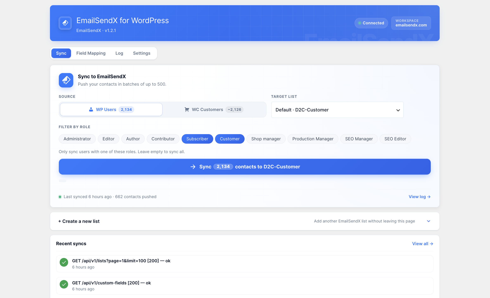
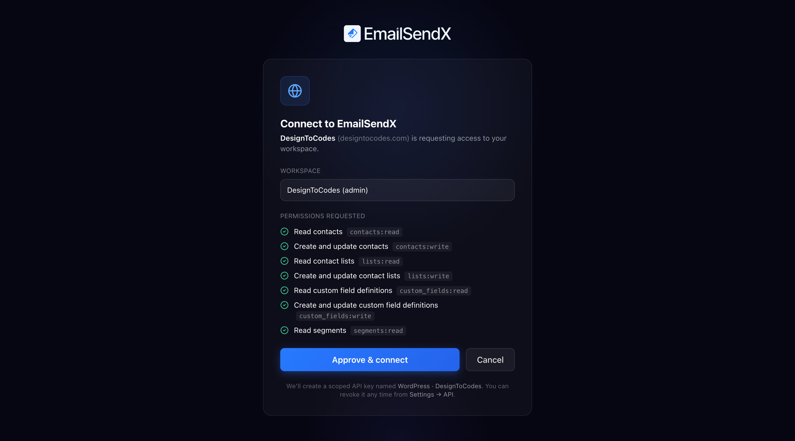
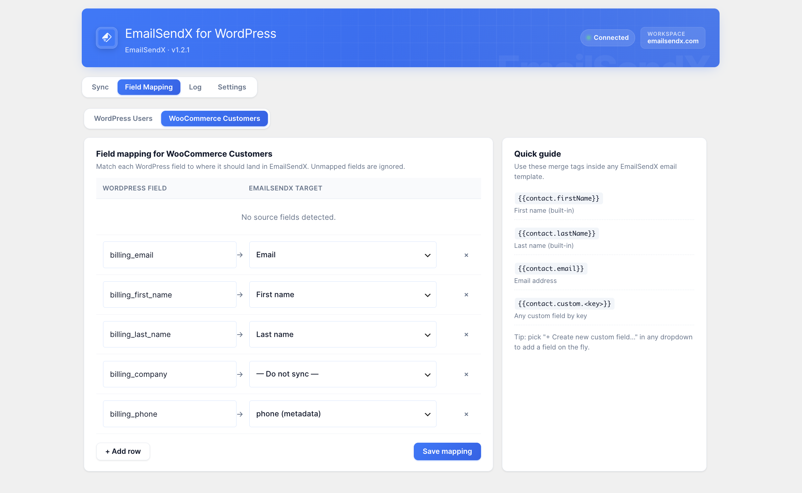
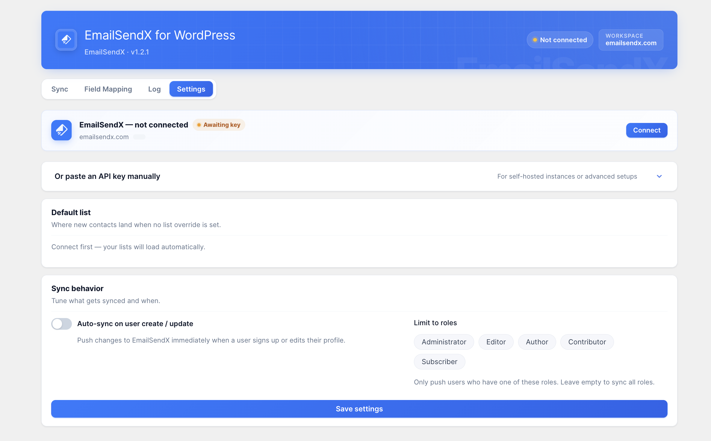

<p align="center">
  
</p>

<h1 align="center">EmailSendX for WordPress</h1>

<p align="center">
  Sync your WordPress users and WooCommerce customers into EmailSendX — automatically.<br>
  Connect once, and every new signup, customer, and profile update flows straight into your contact lists.
</p>

<p align="center">
  <a href="https://github.com/emailsendx/emailsendx-for-wordpress/releases/latest"></a>
  
  
  
  <a href="https://github.com/emailsendx/emailsendx-for-wordpress/releases"></a>
</p>

---

**EmailSendX for WordPress** is the official bridge between your WordPress site and your [EmailSendX](https://emailsendx.com) workspace. Turn on auto-sync once and never touch a CSV again — your campaigns always target a fresh, accurate audience.

It works the same for content sites, membership sites, and WooCommerce stores. WooCommerce is auto-detected — no extra add-on, no extra setup.

<p align="center">
  <br>
  <em>Pick a source and list, filter by role, and push thousands of contacts in one click.</em>
</p>

## Features

- **Set it and forget it** — enable auto-sync once; new users and customers sync on signup and profile update.
- **WooCommerce-aware** — billing name, company, phone, lifetime spend, and last order become mappable fields the moment WooCommerce is active.
- **Field mapping that makes sense** — match WordPress fields to EmailSendX targets in a clean two-column UI, with merge-tag support (`{{contact.firstName}}`, `{{contact.custom.<key>}}`).
- **Create custom fields on the fly** — add new EmailSendX custom fields right from the mapping screen.
- **Manual or automatic** — one-click "Run sync now," scheduled syncs, or sync-on-change.
- **Sync history** — per-batch breakdown of created / updated / skipped / failed, with the API's error messages inline.
- **Per-role and per-list filtering** — sync only the roles you choose, into the list you choose.
- **Auto-updates built in** — see [Updates](#updates) below.

## Screenshots

<p align="center">
  <br>
  <em>One-click connect — approve a scoped API key, nothing to copy-paste.</em>
</p>

<p align="center">
  <br>
  <em>Map WordPress &amp; WooCommerce fields to EmailSendX, with a merge-tag cheat sheet.</em>
</p>

<p align="center">
  <br>
  <em>Connect, choose a default list, and tune auto-sync + role filters.</em>
</p>

## Install

1. **Download** the latest [`emailsendx-sync.zip`](https://github.com/emailsendx/emailsendx-for-wordpress/releases/latest/download/emailsendx-sync.zip).
2. In WordPress: **Plugins → Add New → Upload Plugin**, choose the zip, **Install Now**, then **Activate**.
3. Go to **EmailSendX → Settings** and paste your **API key** (create one in your [EmailSendX dashboard](https://emailsendx.com) under **Settings → API keys**), or click **Connect with EmailSendX** to authorize in one step.
4. Open **EmailSendX → Mapping** and choose which WordPress / WooCommerce fields land where.
5. Hit **Run sync now** on the **Sync** tab to push your existing users for the first time.

Full guide: **[emailsendx.com/docs/integrations/wordpress](https://emailsendx.com/docs/integrations/wordpress)**

## Updates

Once installed, updates arrive **natively inside WordPress** — you'll see an "Update available" notice under **Plugins** and can update in one click (or let WordPress auto-update it). Updates are served straight from this repo's [Releases](https://github.com/emailsendx/emailsendx-for-wordpress/releases); there's nothing extra to install or revisit.

## Requirements

- WordPress **6.0+**
- PHP **7.4+**
- An [EmailSendX](https://emailsendx.com) account — the **free tier works** (high-volume syncs may hit rate limits on free plans).

## Privacy

This plugin sends data to EmailSendX using the API key you configure, and only the fields you map. Nothing leaves your site until you connect a key. See the [EmailSendX privacy policy](https://emailsendx.com/privacy).

## Support

- 📖 Docs: [emailsendx.com/docs/integrations/wordpress](https://emailsendx.com/docs/integrations/wordpress)
- 💬 Questions / bugs: [open an issue](https://github.com/emailsendx/emailsendx-for-wordpress/issues) or [contact us](https://emailsendx.com/contact)

## For developers

```bash
bash tools/build.sh        # → tools/dist/emailsendx-sync.zip (the installable build)
```

Releases are cut automatically: push a version tag and CI lints, verifies the tag matches the plugin version, builds the zip, and publishes the GitHub Release.

```bash
git tag v1.2.2 && git push origin v1.2.2
```

## License

[GPL v2 or later](https://www.gnu.org/licenses/gpl-2.0.html). © EmailSendX.
